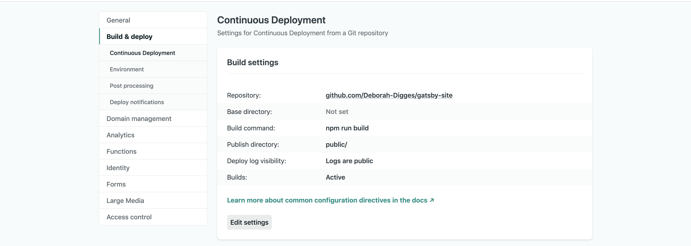

Six years ago, during my final year in college, I was enrolled in a course on Open Source technology. To pass the course was to do two things: contribute to an open source project, and blog about it. Laughably, the only thing that propelled me to start writing publicly was the fear of failing the class.

I passed the course and managed to get some semblance of a blog together. However, I didn't put too much effort into building the site itself since much of my effort was expended in writing the content and trying to creep my way into open source. At the time, Jekyll was all the rage and I went with a themed Jekyll starter called [Lanyon](https://github.com/poole/lanyon).

It served me well over the years, but my unfamiliarity with how it worked kept me from making any substantial changes to the structure of the site. I've finally taken the stand to move to a stack I'm more comfortable with.

## Why Gatsby?

I considered refurbishing my blog with [Gatsby](https://www.gatsbyjs.com/blog/2017-11-08-migrate-from-jekyll-to-gatsby/) and [Next](https://dev.to/joserfelix/how-to-make-a-static-blog-with-next-js-2bd6). I decided to go with Gatsby since it is a little more specialized towards static site generation.

## Let's Get Migrating

### Scaffolding

Getting a Gatsby project up and running is [well-documented](https://www.gatsbyjs.com/docs/quick-start/) on the Gatsby site. Enhancing the project to generate a page from a markdown file is also [clearly explained](https://www.gatsbyjs.com/docs/adding-markdown-pages/).
These are the steps I followed to get the initial project set up for the blog:

- Used the `gatsby-source-filesystem` plugin to read markdown files into Gatsby. Added an entry to the `plugins` key in `gatsby.config.js`.

```
plugins: [{
   resolve: `gatsby-source-filesystem`,
   options: {
    name: `markdown-pages`,
    path: `${__dirname}/src/markdown-pages`
  }
}]
```

- Parsed markdown files using the `gatsby-transformer-remark` plugin which extracted the frontmatter as data and the content as HTML.

```
plugins: [
  {
    resolve: `gatsby-source-filesystem`,
    options: {
      name: `markdown-pages`,
      path: `${__dirname}/src/markdown-pages`
    },
  },
  `gatsby-transformer-remark`
]
```


- Created a [template](https://github.com/Deborah-Digges/gatsby-site/blob/master/src/templates/blogTemplate.js) for blog posts using React to render a blog post's data as a React component.

- Generated pages for all markdown files using the [`createPage` Gatsby API](https://github.com/Deborah-Digges/gatsby-site/blob/master/gatsby-node.js#L55).

- Created an [index page](https://github.com/Deborah-Digges/gatsby-site/blob/master/src/pages/index.js) for all blog articles that displays a list of links.

### Migrating Content
I copied all the markdown files from my old website to the folder indicated in the `gatsby-source-filesystem` config entry: `markdown-pages`. I was now able to see all my old blogs being listed on the index page, albeit with many aspects being broken.

### Fixing All the Things

#### Links
To avoid breaking links, I used the same slug format as before: `YYYY/MM/DD/Title`. In my case, the slug was derived from the filename instead of the frontmatter, which required a little special handling.

- Used [createFilePath](https://github.com/Deborah-Digges/gatsby-site/blob/master/gatsby-node.js#L8) to access the filename
- Extracted the slug and the date from the filename and them passed along as node fields, available to subsequent page queries.

```
const result  = extractMetadataFromFilename(filePath);
date = result.date;
slug = result.slug;
createNodeField({ node, name: `date`, value: date });
```
#### Highlighting

In my old Jekyll site, I was using `pygments` for syntax highlighting of code snippets, which used syntax like this to create a highlight:

```


  void f(int x, int n)
  {
    Gadget * g = new Gadget{n}; // Look ! I’m a Java Programmer :)
    if(x < 100) throw std::runtime_error{"weird"}; //leak
    if(x < 200) return; //leak
    delete p;
  }


```

Since this no longer worked in Gatsby, I changed all highlights to be enclosed in three back-quotes which translates to a `<pre>` tag enclosing a `<code>` blog.

I would like to eventually embed gists directly into my posts, but that's an improvement for a later blog post.


#### Images

To make Gatsby aware of where my images were located, I added another plugin entry for the `gatsby-source-filesystem` plugin.

```
{
  resolve: `gatsby-source-filesystem`,
  options: {
    name: `images`,
    path: `${__dirname}/src/images`,
  },
}
```

I then modified the plugin entry for `gatsby-trasformer-remark` to add the `gatsby-remark-images` plugin to it.

```
{
  resolve: `gatsby-transformer-remark`,
  options: {
    plugins: [
      {
        resolve: `gatsby-remark-images`,
        options: {
          maxWidth: 800,
        },
      },
    ],
  },
}
```

With this configuration, I was able to embed images inline using the familiar markdown format:

```

```

It's important to use a relative path to the `images` folder.

```
- src
  - markdown-pages
  - images
```

For the directory structure above, `../images/image.png` would be the path to an image referenced in a markdown file.

#### Gifs

`gatsby-remark-images` cannot handle gifs. I added the `gatsby-remark-copy-linked-files` plugin to properly handle any gifs that gatsby encountered.

```
{
  resolve: `gatsby-transformer-remark`,
  options: {
    plugins: [
      {
        resolve: `gatsby-remark-images`,
        options: {
          maxWidth: 800,
        },
      },
      `gatsby-remark-copy-linked-files`
    ],
  },
}
```

#### Favicon

Again, I invoked the mighty plugin system of Gatsby and added another plugin entry in `gatsby-config.js`.

```
{
  resolve: `gatsby-plugin-favicon`,
  options: {
    logo: "./src/favicon.ico"
  }
}
```

### Styling

I lazily copied over the [poole/lanyon theme](https://github.com/Deborah-Digges/gatsby-site/tree/master/src/styles) to avoid me having to write any CSS. Let's not kid ourselves, I don't really know how to design a site.

Since these are global CSS styles, I needed to import them into the `gatsby-browser.config.js` file to make them apply to the generated HTML files.

```
import "./src/styles/poole.css";
import "./src/styles/lanyon.css";
import "./src/styles/Calendas_Plus.otf";
```

### Deploying

To test the site out and compare it with my old site, I [deployed](https://epic-mirzakhani-8e39a6.netlify.app/) the site to [Netlify](https://www.netlify/). It was about as simple as going to the Netlify site, authorizing access to my GitHub repo, and providing a build command.



### Testing that no links are broken

With my site deployed to Netlify, I tested that no links were broken by ensuring that each link on the old site also existed on the new site:

```
links.forEach(link => {
  link = link.replace("deborah-digges.github.io", "epic-mirzakhani-8e39a6.netlify.app");
  request(link, (err, res, body) => {
    if (err) { console.log('Page fetch failed', err); }
    console.log(link, res.statusCode);
  });
});
```

I ran the following script on each of the two pages of my blog to extract all the links:

```
let links = document.querySelectorAll("a");
let siteLinks = []
for (let i=0; i < links.length; i++) {
  let linkText = links[i].textContent;
  linkText = linkText.replace(/\s+/g, ' ').trim();
  const link = links[i].href;
  siteLinks.push([linkText, link]);
}

for(let i=0; i < siteLinks.length; i++) {
  console.log(siteLinks[i][1]);
}
```

Admittedly, it's a little rudimentary, but hey! it did the job.

### Switching over

Once I was ready to bid adieu to the shackles of my Jekyll site, I overwrote my Github User Pages [repository](https://github.com/Deborah-Digges/deborah-digges.github.io) with the shiny new Gatsby site. I will be going over the details of deploying a Gatsby site to GitHub Pages in a subsequent blog post!

## Next Up

Now that I'm using a system I understand a little better, I want to soon:

- Implement pagination
- Create categories for pages and allow browsing the blog by category
- Create a navigation element called `Content` in the header which expands to Blogs, Drawings, Book Reviews
- Create a `Reading List` navigation element
- Lean enough about CSS and design to create a better landing page (Maybe hire a designer?)

If you'd like to check it out, you can find the source code [here](https://github.com/Deborah-Digges/gatsby-site).

Tune in again for more exciting updates to my Gatsby blog!

