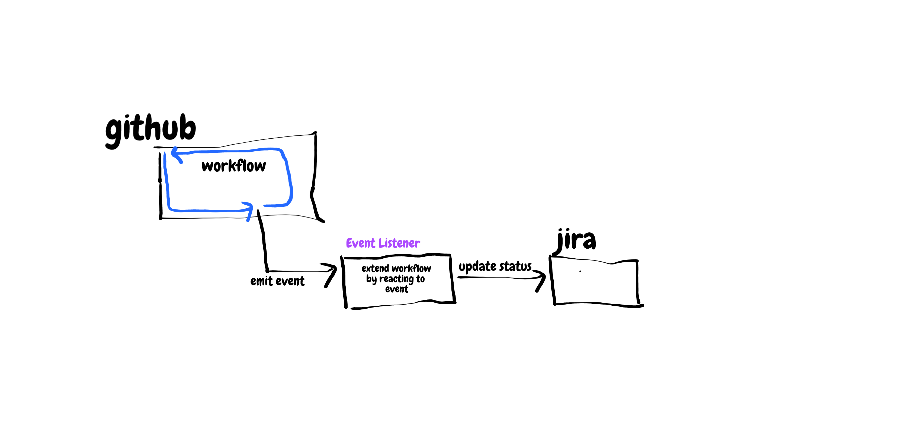
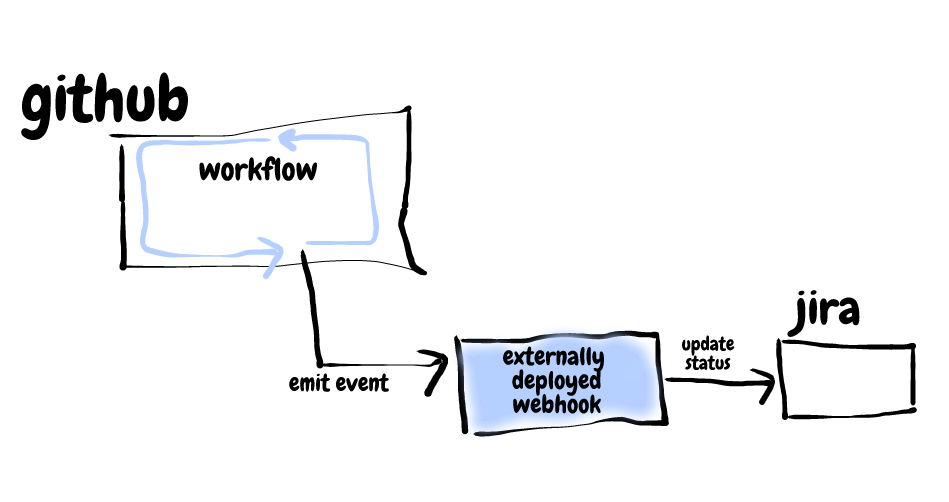
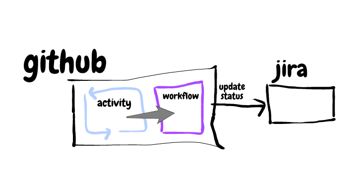
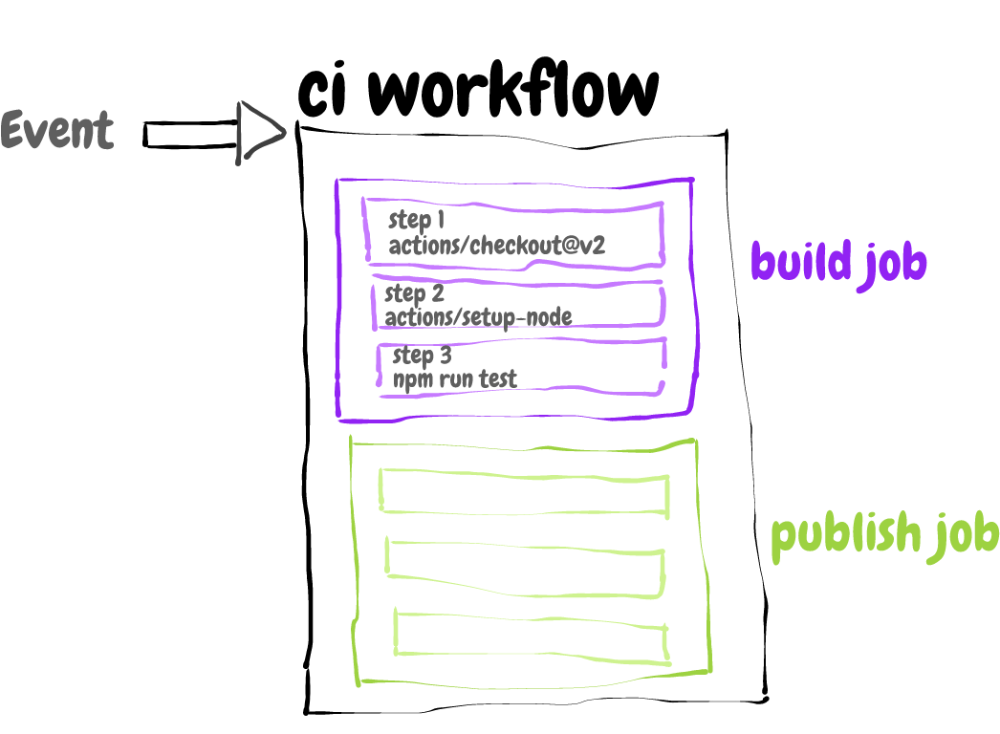
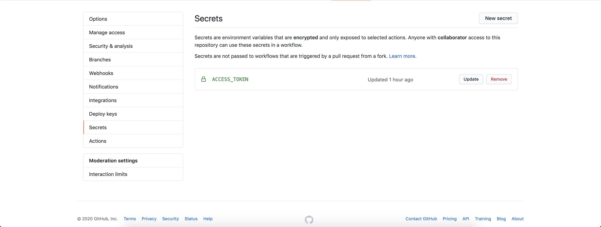

In my [last post](https://deborah-digges.github.io/2020/10/03/github-actions-gatsby-deploy), I did a quick overview of GitHub Actions and demonstrated how to use an [existing action](https://github.com/marketplace/actions/gatsby-publish) to deploy a Gatsby site to GitHub Pages. In this post, I'd like to dive deeper into GitHub Actions exploring the underlying motivation behind it, the architecture, and the steps involved in building a custom action.

Before getting into the specifics of GitHub Actions, let's understand their value proposition by delving into GitHub events, and how GitHub has supported the handling of these events.

## What Are Events?

> Don’t call us, we’ll call you.

An event is a message used by a software component or system to notify a change in its state to another component or system.

For example, within a software system, an *Orders* component may notify a *Notification* component about a new order placed so that the notification component can send an email to the customer confirming the order.

Software as a Service (SaaS) products emit events to allow customers of these products to extend core product flows. For example, an e-commerce site integrating with Stripe for payments could use a Stripe [event](https://stripe.com/docs/api/events) to react to an anomalous payment activity. For example, if a user of the e-commerce site disputes a payment processed on Stripe, the `charge.dispute.created` event generated by Stripe could be used to notify the e-commerce site's operations team to look into the matter further.

Events are fundamental to the extensibility of a product. They allow you to extend existing product flows to hook into the tools and processes that you or your organization already use.

## GitHub Events

[GitHub](http://github.com/) provides hosting for software projects and version control using git. It has formed the nucleus of the software development lifecycle by supporting collaboration across teams (often distributed), code reviews, and project management.

[GitHub events](https://docs.github.com/en/free-pro-team@latest/developers/webhooks-and-events/webhook-events-and-payloads) play a big part in helping GitHub do what it does best while also providing extensibility points to integrate with other tools used in the software development lifecycle. You might use GitHub for collaborating on the source code, JIRA for project management, and Confluence for documenting processes. GitHub events help you extend typical activities performed on GitHub to hook into these other tools that you already use.

> “Each event corresponds to a certain set of actions that can happen to your organization and/or repository. For example, if you subscribe to the issues event you'll receive detailed payloads every time an issue is opened, closed, labeled, etc.” - The GitHub Events Documentation


For example, when a pull request is merged in GitHub, you might want to update the status of the corresponding story in JIRA.




## What GitHub Events Can We React To?

Github provides pretty good [event coverage](https://docs.github.com/en/free-pro-team@latest/actions/reference/events-that-trigger-workflows). You can hook into a large number of activities performed on GitHub and extend them according to your team or business' needs.


## Reacting to Events &#151; The Before Times

So, how do you listen for and react to GitHub events? Before GitHub Actions, [webhooks](https://docs.github.com/en/free-pro-team@latest/developers/webhooks-and-events/about-webhooks) were the recommended way to consume GitHub Events.

The *Event Listener* in this case is a web service that exposes an HTTP endpoint. You'd configure your repository with this endpoint. GitHub would POST events to this endpoint whenever events of interest happened in the repository.




Setting up a webhook to respond to an event looks something like this:

1. Create a webservice that exposes an HTTP endpoint and contains the logic to handle events of interest
2. Configure a webhook in a GitHub repository by providing the HTTP endpoint specified in (1)
3. Parse the event payload received from GitHub in the HTTP endpoint and respond appropriately.

The biggest drawback of webhooks is having to stand up an external service. This means writing a new service, deploying it, and maintaining it.

There are entire CI platforms built around GitHub events and webhooks. For example, when you [enable a GitHub repository to be built on Travis CI](https://deborah-digges.github.io/2020/09/24/gatsby-deploy), a webhook is set up that pushes events to an externally hosted Travis CI server (you don’t have to explicitly maintain the server in this case, but it is still an external dependency).


## Enter GitHub Actions

[GitHub Actions](https://docs.github.com/en/free-pro-team@latest/actions/creating-actions/about-actions
) provide a way to react to GitHub events within the GitHub platform instead of having an independently deployed webhook to receive events.



> “GitHub Actions is your workflow: built by you, run by us.” — The GitHub Blog

GitHub Actions provide a number of advantages:

1. Provides the ability to react to events within GitHub. Avoids introducing a third-party tool and prevents data from flowing through another service.
2. Provides a [lower pricing plan](https://docs.github.com/en/free-pro-team@latest/github/setting-up-and-managing-billing-and-payments-on-github/about-billing-for-github-actions#about-billing-for-github-actions) than a separate service for CI/CD. It is free for public repositories and pay-as-you-go for private repositories.
3. Allows the reuse of shared workflows. This point is especially important, as it prevents developers from having to solve the same problems over and over again. Instead, public workflows create an [ecosystem of Actions](https://github.com/marketplace?type=actions) that developers can fork, edit, iterate, and improve upon, much like code.


## The Building Blocks &#151; Workflow, Jobs, Steps, Actions, Runners

A GitHub Event triggers a **Workflow**. A Workflow is run on a **Runner**.

- A **Workflow**  has one or more jobs (that by default run in parallel)
- A **Job**  has one or more steps that execute on the same runner. Steps in the same job can pass data between them
- A **Step** (individual task) has 1 action
- An **Action** is the smallest standalone components combined into steps to create a job
- A **Runner** is a server that has the GitHub Actions runner application installed which listens for jobs, runs one job at a time, reports progress, logs results

A picture is worth a thousand words:



## What Exactly **is** a GitHub Action?

An action is the smallest standalone component in a workflow. As we saw above, it can be combined into steps to create a job. It runs a bit of code and has the ability to pass information to the next step in a job. There are [two ways](https://www.reddit.com/r/docker/comments/gopv3w/github_actions_docker_containers_vs_javascript/) we can write a GitHub Action:

### Javascript Action

Here, you write the code for the action in Javascript. This code is executed using the version of node you specify in the action.yml (more on this later). The version of node supported is mentioned in the [runner specification](https://docs.github.com/en/free-pro-team@latest/actions/reference/specifications-for-github-hosted-runners).

There are a few drawbacks to this approach.
1. The action is dependent on the version of Node available on the runner. If you use your own runner running node 10, Javascript actions written for node 12 will not work correctly.
2. Dependencies need to packaged with the action (either by including the node\_modules folder in the action repository or by packaging the node\_modules folder into a single file using [vercel/ncc](https://docs.github.com/en/free-pro-team@latest/actions/creating-actions/creating-a-javascript-action#commit-tag-and-push-your-action-to-github))

### Docker Container Action

Docker containers bundle the environment and code of a GitHub action together which makes it a more reliable way of packaging an action. The consumer of the action does not need to worry about the tools or dependencies used in the action. For example, if the action specified a node version of 12 but was run on a non standard runner which ran node 10, this would cause issues. Using a Docker container which bundled the correct version of node with the action would avoid such issues.


## Creating a Javascript Action

In a [previous post](https://deborah-digges.github.io/2015/10/23/pr-bot), I described how I set up a GitHub webhook to comment on pull requests opened by new contributors on a repository. We're going to recreate this behavior using a GitHub Action.

### Initializing The Repository

1. Create an empty folder
2. Inside the folder: `npm init -y`

### Describing Our Action
Create an `action.yml` file in the same folder. This file contains metadata that describes the intent of this action, its inputs, and its outputs.

`gist:Deborah-Digges/342ad72d6960e733dbf0634bc2b0e7b3`

This action needs to have an `access-token` to be able to comment on a pull request on behalf of a user. The welcome `message` to new contributors is also configurable.

We specify that the action *runs* on `node12` and also specify the entry point (where the code for our action is located).


### Adding Toolkit Dependencies

GitHub provides an action [toolkit](https://github.com/actions/toolkit) with basic utilities that are required by any action. We will use these utilities for reading the event, getting a GitHub API client configured with a token, and other niceties that we don't want to have to end up building ourselves.

```
npm install @actions/core
npm install @actions/github
```

### Writing The Action Code

`gist:Deborah-Digges/f0edad96e22bfe272a888aaa659a783f`

- We import the `core` and `github` modules from the GitHub action toolkit
- We access the inputs to the action using the `core.getInput` function
- We access the event payload using the `github` module: `github.context.payload`
- We create a GitHub client using the `github` module: `github.getOctokit(accessToken)` with the accessToken obtained from the inputs
- We inspect the `payload` to see if it is a new pull request (i.e. the status is `opened`). We also check to see if this is a pull request made by a new contributor
- If it is, we use the `githubClient` we created previously to comment on the pull request: `githubClient.issues.createComment`

And that's it!

### Commiting the Code

1. Add the `src` folder, `package.json` and `package-lock.json` files, `node_modules` folder
2. Commit your changes
3. Tag your changes
4. Push your changes to a Repository on Github

To see the complete code for this GitHub Action, check out my repository on [GitHub](https://github.com/Deborah-Digges/new-pull-request-comment-action).

## Using Your Action in a Repository Workflow

In the repository where you'd like to use this action and comment on pull requests made by new contributors automatically, add a `.github/workflows` folder. Add a `.yml` file to this folder to describe this workflow:

`gist:Deborah-Digges/2de5897ec7b4b54714e3150dabda46d7`

Here is where you specify the *Events* you want to run the action in response to. In our case, we want it to be *on* a `pull_request` to the `main` branch.

The workflow has a single job called `comment` which has a single step that consists of the action we created. We reference the action we created using this format: `deborah-digges/new-pull-request-comment-action@v1.9 ` which indicates:

- The GitHub username or organization under which to find the action
- The repository name
- The version of the action (This could either be in the form of a tag or a commit)


### Adding An Access Token

We specify the input to our action using `${{ secrets.ACCESS_TOKEN }}`. Add a [Personal Access Token](https://github.com/settings/tokens/) to the `Secrets` section in your repository.



See the full source code of this repository that makes use of the action [here](https://github.com/Deborah-Digges/test-github-action).


## Giving The Action a Test Run

Go ahead! Test out your new workflow by making a pull request to your repository! If this is the first pull request you're making to the repository, you should [see a welcome message](https://github.com/Deborah-Digges/test-github-action/pull/13#partial-pull-merging) from your friendly GitHub Action!


I hope you enjoyed this deep dive into GitHub Actions. Stay tuned for my next post where I'll go over the details of how to make a Docker GitHub Action. Exciting times ahead!


