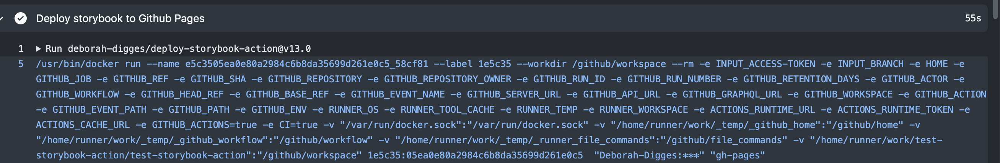

In my [previous blog post](https://deborah-digges.github.io/2020/10/14/Building-a-Github-action), I described in detail the motivation behind GitHub actions, their architecture, how events flow through GitHub, and how to create a custom GitHub Action from scratch using Javascript.

I went over the two types of actions: Javascript actions and  Docker container actions. Most of the open-source actions I’ve explored seem to be built using approach Javascript actions, perhaps for these reasons:

1. They can make use of a handy Github [toolkit](https://github.com/actions/toolkit) that provides libraries to access the action inputs and a GitHub client that can be configured with a token
2. All GitHub Runners support Node 12 out of the box which makes it very simple to write actions based on this version of Node&#151;no extra configuration required. To look at the supported software on various GitHub Runners, take a look at the documentation [here](https://docs.github.com/en/free-pro-team@latest/actions/reference/specifications-for-github-hosted-runners#supported-software).

## When Would You Use a Docker Container Action?

The Docker Container Action shines in a few cases:

1. **Using Javascript is not an option**
    - Maybe your team is familiar with other languages or frameworks.
    - Maybe you prefer to keep all your tools consistent&#151;maybe you write all their tooling in Go and would like to continue to do so.
    - Maybe you’d like to make use of a utility or library not available in Node&#151;for example, a python script for munging or parsing data that your team has already written and that you don’t want to port over to Javascript.
2. **Using a specific version of Node(12) is not an option**: Maybe you would like to base your action off a different Node version.

Even if you do use the supported version of Node 12 to build your action, it still may benefit you to use a Docker Container Action for a few reasons:

1. You’d no longer need to include the `node_modules` folder directly in your action repo. You could have a `package.json` file which enumerates dependencies and have your docker container pull the dependencies when the action is run.
2.  Bundling the environment needed to run an action with the action itself would prevent possibly breaking changes during software upgrades on the GitHub runner environment.

## Creating a Docker Container Action

While looking for interesting actions to build, I stumbled across [this action](https://github.com/storybookjs/action/) in the [StoryBook GitHub organization](http://github.com/storybookjs) that hadn’t been fully fleshed out yet!

It is an action that is meant to build and deploy a Storybook site to either GitHub Pages or an AWS S3 bucket. I’m going to go over how to build a GitHub Docker Container Action for this use case.

For the hello world introduction to Docker Container actions, check out the [GitHub docs](https://docs.github.com/en/free-pro-team@latest/actions/creating-actions/creating-a-docker-container-action).

### Defining the Action

We first define the interface of the action&#151;its inputs, its outputs, and its environment&#151;in an `action.yml` file in the root of the repository.

`gist:Deborah-Digges/bf750b042e9f403356d792b6198ee5b2`

#### Inputs to the Action

We specify the following inputs to the GitHub Action:
1. `access-token`: A GitHub Personal Access Token required to push to a specific branch on the repository.
2. `branch`: The target branch to which to deploy the Storybook site.

#### Docker Image for the Action

Docker Container Actions specify the image using which to start a container in which the action's code is run.

For Docker Actions, we specify the action to run using `docker`. The `image` could be indicated in one of two ways:

1. Using the Dockerfile in the action’s repository:

`gist:Deborah-Digges/663207528155414186a80192b49821c2`

This is what we've used in our example.

2. Using an image on the public Docker Registry:

`gist:Deborah-Digges/ffa72e3e03047d30122c67d7b9d6d912`

#### Passing Inputs to the Docker Container

Ideally, I would have liked that the inputs specified for the Docker Action were automatically passed to the Docker Container when it started. However, there is an [extra step](https://docs.github.com/en/free-pro-team@latest/actions/creating-actions/metadata-syntax-for-github-actions#runsargs) needed to do so. `args` specify the arguments to be passed to the Docker container when the Job runner runs the action.

`gist:Deborah-Digges/828a121f284bfae2de69fa95dfee73bb`

The job runner passes the args to the container's `ENTRYPOINT` when the container starts up.

### Creating the Dockerfile

We follow the standard syntax and principles for writing Dockerfiles with a few caveats specific to the GitHub implementation outlined [here](https://docs.github.com/en/free-pro-team@latest/actions/creating-actions/dockerfile-support-for-github-actions).

`gist:Deborah-Digges/bb4f02d6d0334880b5b96ffd229e10f2`

The Dockerfile for this action uses `alpine` linux as a base for the image, adds node and git, and instructs Docker to run `entrypoint.sh` when a container starts using this image.

The Github runner will will build an image from our Dockerfile, start a container using this image, and run the code in `entrypoint.sh` when the container is started.

The container is started by the GitHub job runner using the following command which passes a lot of required parameters to the container:

Some important ones are:

1. `--workdir /github/workspace`: it sets the working directory of the container to the runner workspace (where, in this case, the repository has already been cloned). This directory is also passed as the `GITHUB_WORKSPACE` environment variable.
2. The `args` specified in `action.yml` are passed as the last arguments:
    - `Deborah-Digges:***`: obfuscated GitHub token.
    - `gh-pages`: branch on the repository to push to.

### Running Code in the Container!

We’ve specified our `ENTRYPOINT` to be a bash script, and we could run a Node script, a python module, or pretty much anything we wanted!

In this case, instead of writing the code to build and push a Storybook site to Github pages, we're going to use [storybook-deployer](https://github.com/storybookjs/storybook-deployer). Sorry for cheating! It’s not complete, because, as you see, it assumes a lot of things about the project (like the fact that it uses npm and not yarn, for example).

`gist:Deborah-Digges/ab501c9044e10b6444fecd2f945879cc`

The steps to deploy the storybook site:

1. Install the `storybook-deployer` dependency.
2. Run storybook-deployer with the correct branch and token arguments.

## Using a Docker Container Action in a GitHub Workflow

Let’s see how we can use this action inside a repository which uses Storybook, to build and deploy the Storybook site to the `gh-pages` branch of GitHub on every push to master.

We need to create a workflow file in the repository located at `.github/workflows`.

`gist:Deborah-Digges/8c538939f6e5492177969df54afe61bb`

We specify that we want this workflow run on every *push* to the branch *master*. This workflow has a single job called `build` that has 3 steps:
1. Checkout the repository using the `actions/checkout@v2` action.
2. Install dependencies by running a script.
3. Deploy Storybook site to GitHub Pages using the action we just created.

We specify an action using the syntax `deborah-digges/deploy-storybook-action@v13.0` which include:
1. The owner or organization name.
2. The repository name.
3. The version which could be a tag or a commit ID in the repository.

To see this workflow in [action](https://github.com/Deborah-Digges/test-storybook-action/actions/runs/334499434) (no pun intended), check out  [this](https://github.com/Deborah-Digges/test-storybook-action) repository that uses the action we just built to deploy a Storybook site to [GitHub Pages](https://deborah-digges.github.io/test-storybook-action/)

## Do you need a GitHub Action?

It’s a good exercise to think about whether we need a separate GitHub Action to encapsulate the logic in a step or whether it can be performed within the workflow itself.

To understand this better, it's important to remember that a step in a workflow can either be:
1. An action that encapsulates some logic, invoked using the inputs required by it.
2. A bash command run within the Workflow itself.

In this case, the amount of reusable logic in the action we just built is negligible, and the action is just a thin wrapper around the `deploy-storybook` tool that exists already. We could just as well run this tool directly within the workflow.

Changing the workflow file to run the action code within the workflow file does the same job without having to create and maintain a brand new action repository!

`gist:Deborah-Digges/342c40700fdbcac30629c93093cd1838`

The question we should really answer before embarking on writing a standalone GitHub Action is:

*Would other people benefit from this abstraction?*

If the answer is no, we probably don’t need to write a new GitHub Action.

## Wrapping Up

In this article we learnt how to write a Docker Container Action.

Check out the code for the action itself [here](https://github.com/Deborah-Digges/publish-storybook-action).

Also, check out how this action is used in [this Storybook project](https://github.com/Deborah-Digges/test-storybook-action)

If you’d like a quick refresher on what GitHub actions are, why they’re useful, or how to write a Javascript action, check out my [previous article](https://deborah-digges.github.io/2020/10/14/Building-a-Github-action)

