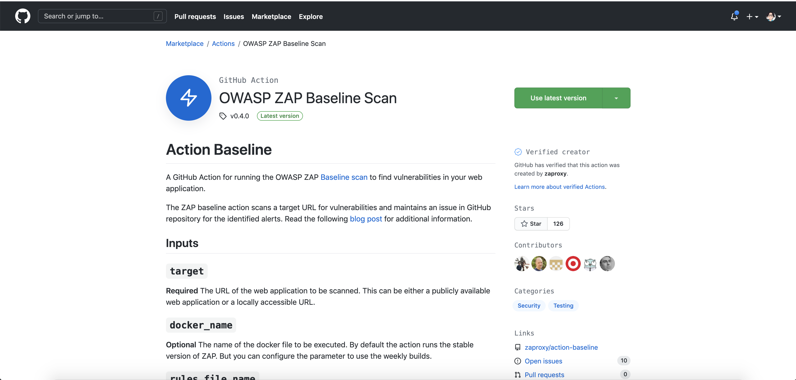
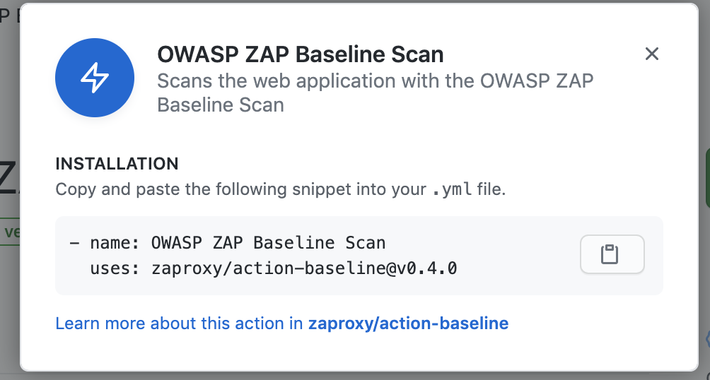
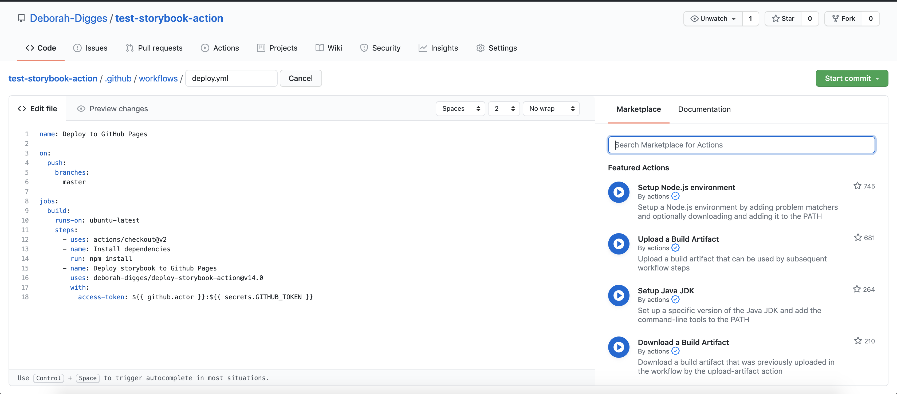
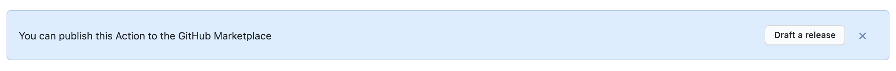
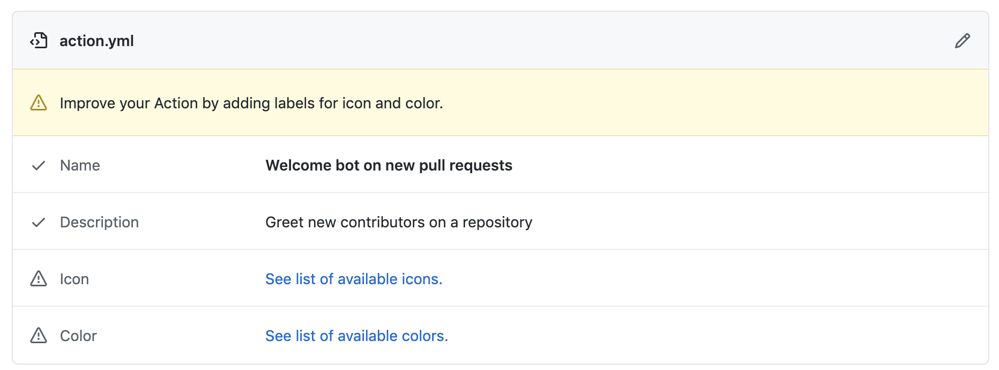
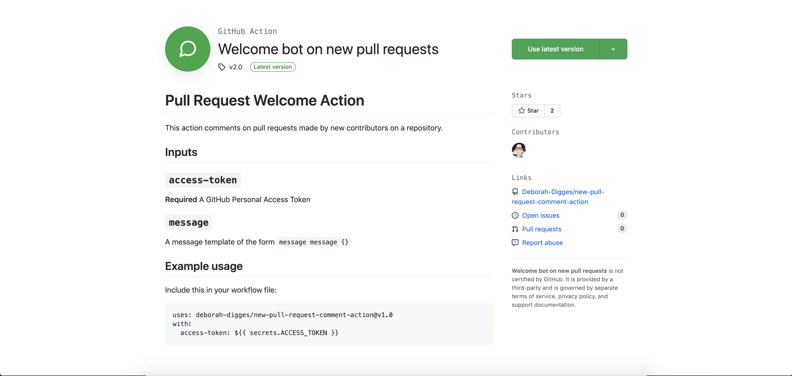
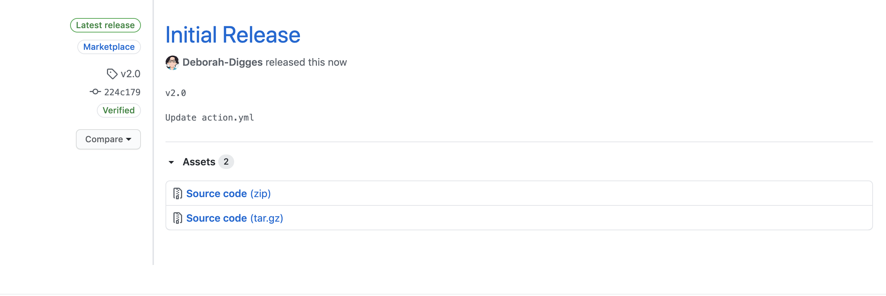

In my previous posts exploring GitHub actions, I’ve explored how to use public actions on the [GitHub Marketplace](https://github.com/marketplace). In this post, I’d like to go over how to efficiently navigate the Marketplace as a developer.

## Searching for Actions

### Directly in the GitHub Marketplace

The [GitHub Marketplace](https://github.com/marketplace) is home to two kinds of tools that extend GitHub’s core functionality:
1. Apps
2. Actions

To search for Actions directly on the GitHub Martketplace, you can filter by the `Actions` Type in the Sidebar.


Once you find an action of interest, you can use it in a GitHub workflow by clicking on the `Use latest version` button.



You can then copy the YAML snippet into your workflow file.




I wasn’t thrilled about this workflow when I was getting started with GitHub Actions and was hoping for something like a one click option to get an action into my workflow. I recently discovered that this was possible in a different way than I hoped for.

### Within the Workflow Editor in Github

Opening a GitHub workflow file in the GitHub editor brings up a search bar on the right hand side, which allows you to search for GitHub actions to add to your workflow without leaving your workflow editor!



This gives you the snippet of code that you need to include in your workflow to add the action.


It still involves copying YAML from one place to another, but is a lot better than the previous workflow of having to copy the YAML all the way from the Marketplace.


## Making Use of a Public Action from the GitHub Marketplace

In the YAML snippet we copied above, a public action is specified using the following syntax:

`{org/username}/{repository name}@version`


### Using a specific version of an action

The version in the format above can be a:

1. **Commit hash**: A commit hash is the most robust form of versioning because, unlike a tag which can be deleted, or a branch that can be updated, it is a point frozen in the repository’s history (unless someone does something silly like force push to master).
2. **Tag**: While more stable than a branch, a tag can still be deleted and cause your workflow to break.
3. **Branch**: This is the least stable option, wherein you get the latest changes on a particular branch of an action whenever your workflow runs.

The option you choose depends on your use case, but tags seem to be the most common option I’ve seen being used for versioning actions.

### Keeping an action up to date with dependabot

If you use a public action, you’d probably want to be on the look out for new versions on the Marketplace, especially for versions that might patch critical security vulnerabilities. Doing this manually is rather a bore; using a tool like dependabot allows you to [automate scanning for new versions of an action](https://docs.github.com/en/free-pro-team@latest/github/administering-a-repository/keeping-your-actions-up-to-date-with-dependabot
).

[Dependabot](https://dependabot.com/) is a tool capable of automating the updates of dependencies of various kinds. GitHub actions is a special case of dependency handling for your GitHub workflows, which dependabot also supports.

Dependabot will scan all actions that your GitHub workflow depends on and create a pull request to your repository updating the version of an action used in your workflow, whenever a new version is available.

To enable dependabot on your workflow or action, add a `.github/dependabot.yml` file to your repository:

```
version: 2
updates:

  - package-ecosystem: "github-actions"
    directory: "/"
    schedule:
      # Check for updates to GitHub Actions every weekday
      interval: "daily"
```

- The `package-ecosystem` is set to `github-actions` to tell dependabot to monitor for new versions of GitHub actions
- The `schedule` allows you to set the scan frequency.


## Publishing a Custom Action to the Marketplace

In previous blog posts, I went over [how to build a Javascript GitHub Action](https://medium.com/better-programming/a-deep-dive-into-github-actions-51e234da0c50) and [how to build a Docker GitHub Action](https://medium.com/better-programming/delving-into-docker-container-actions-588332af5869). Once you create a GitHub Action, you can publish it to the GitHub Marketplace so that other developers can find it either on the GitHub Marketplace or in the workflow editor.

Publishing an action to the marketplace requires that you have:
1. A public GitHub repository with your GitHub Action code
2. An `action.yml` file in the root of your repository

You should then see a banner at the top that prompts you to publish your action to the GitHub Martketplace



You will then be prompted for some basic information before you can submit your action to the marketplace.



If you’d like to add some branding, you can do so by adding the following snippet to your `action.yml` file.

```
branding:
  icon: 'message-circle'
  color: 'green'
```

After that choose a category, provide a release tag, and voila! You’re live on the Marketplace.



## Releasing a New Version of your Custom Action to the Marketplace

Every time you want to release a new version of your GitHub action, head to your repository, and click on the **tags** button.

Click on **Releases**, and the **Draft a New Release** button and you should now be able to fill in the same information as before to release a new version of your action to the GitHub marketplace.




## Looking to Learn More About GitHub Actions?

If you’re looking to learn the basics of GitHub Action and how to run workflows using custom and public actions, check out some of my previous blog posts:

1. [A Deep Dive Into GitHub Actions](https://medium.com/better-programming/a-deep-dive-into-github-actions-51e234da0c50) - learn about what GitHub actions are, why they’re important, and how to build a Javascript GitHub Action from scratch.
2. [Delving into Docker Container Actions](https://medium.com/better-programming/delving-into-docker-container-actions-588332af5869) - learn how to build a Docker Container Action, and when to build a new action vs. execute code within a workflow.
3. [Deploy your Gatsby Site with GitHub Actions](https://medium.com/better-programming/deploy-your-gatsby-site-with-github-actions-e761ea93813f) - Learn how to use a public GitHub Action to create a CD pipeline.

Thanks for reading!
