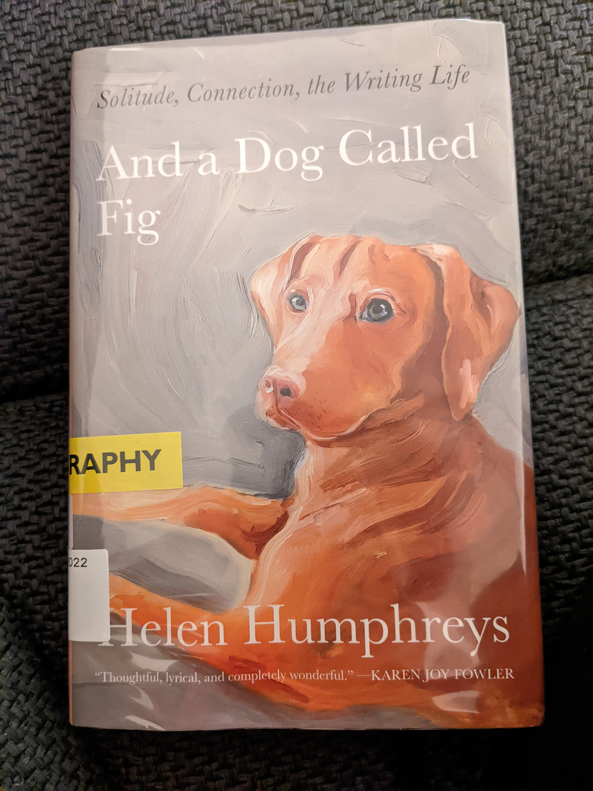

I’ve never had a dog, so I've never understood the joy and pain of looking after one. When I was a child, I was once doggedly chased by a stray dog (stray dogs were very common where I grew up in India). That experience left an imprint of trauma on me that I haven't since been able to shake off. Whenever a dog approaches me, no matter how adorable and fluffy it may be, my first instinct is to turn around and run as far and fast as my legs will take me.

Lately, I've been more intrigued by dogs. I now live in Toronto where pets and their owners abound and there is no dearth of pet watching opportunities. I've come to observe and appreciate the endearing relationships between pets and their people. Reading [And a dog called Fig](https://www.goodreads.com/book/show/57693612-and-a-dog-called-fig) recently deepened this new found appreciation and wonder.

The author Helen Humphreys writes of her life of dogs with tenderness and conviction. As the book starts out, she has recently adopted a puppy Fig after her beloved Charlotte passed away. The book is a journal of her experience raising the puppy and how their connection strengthened over time. As someone who's never had a dog, the day to day of raising a puppy seemed almost alarming to me. To think that puppies bite you and draw blood until you train them to understand that it hurts you almost makes me never want to get one. The amount of effort involved in raising and training a puppy seems almost commensurate with that of raising a child! Not for the faint of heart!

The author speaks of the companionship that her dogs have provided in her writing journey over the decades. A dog seems like the perfect companion for a writer. While a writer must tear themselves from the present moment to immerse themselves in the story they are trying to tell, a dog is much more inclined to fully inhabit the present moment. The dog therefore serves as a bridge between the story and the real world, pulling the writer back into the present when they have gone too far. The dog must be walked 3-4 times a day, fed, and socialized. The needs of the dog are highly physical, deeply rooted in the present moment, and forces structure on the writer. It pulls them out of their writing trance, immerses them in nature, which can be distracting in the moment but actually serves to recharge their creative reservoirs.

With that background, it isn't surprising that a lot of famous writers in history have had dogs. The author sprinkles anecdotes of famous writers and their dogs(also quite famous) throughout the book. I particularly enjoyed the account of Virginia Woolf and her dog Grizzle. The dog was a big part of her life and also her writing. Grizzle is sometimes conflated with Woolf herself in her letters to her lover:

>That's what comes of attacking your poor Virginia and dog Grizzle. They bite instantly. But at the same time they adore; and if you hadn't the eyes of a newt and the blood of a toad, you'd see it, and not need telling...

"Eyes of a newt and blood of a toad" is an excellent insult that I must appropriate. I have since added a large laundry list of Virginia Woolf's books to my to-read list.

Overall this book left me feeling very warm inside. I am left with a greater appreciation of the relationship between pets and their people. I’ve also got to see the role a dog plays in the life of a writer from close quarters. Humphrey’s writing magic is in taking these lived experiences and translating them into a form that can be appreciated by someone who has never had a dog and is also terrified of dogs. This book is without a doubt a 5/5 for me!
