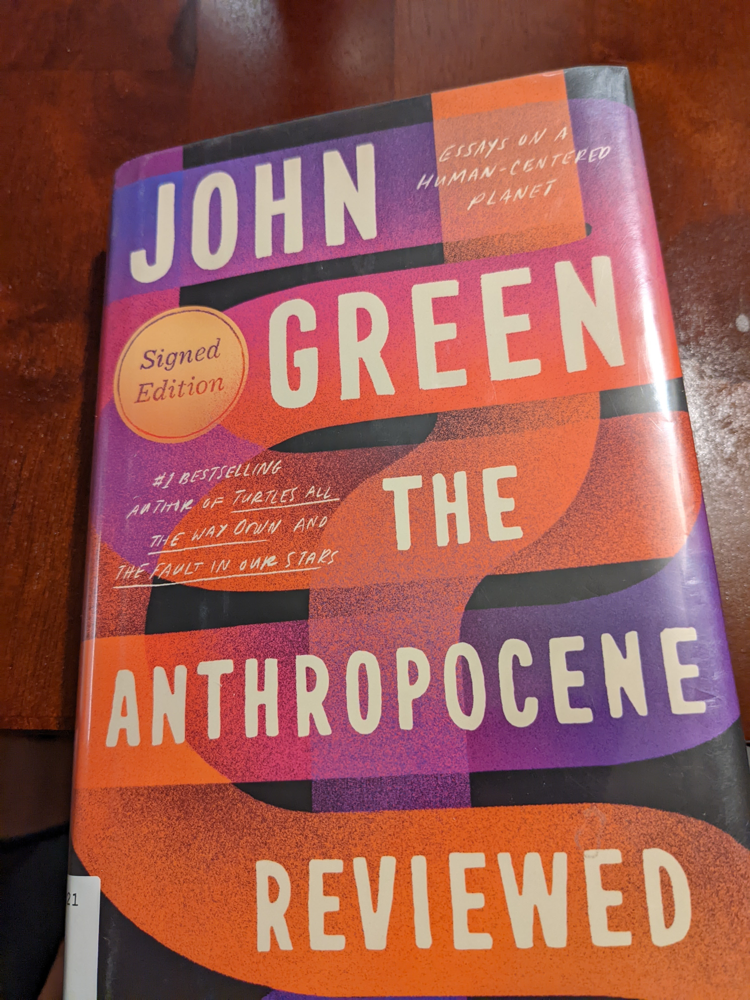

*The Anthropocene Reviewed* was recommended to me by a friend when the Omicron wave of COVID hit in January making an already bleak winter almost hopeless. It is the kind of book one can read in bursts with whatever fragments of attention run surplus after a long day. Each chapter is short - no more than 5 pages and rates a particular phenomenon in the 
*anthropocene* on a 5 point scale. 

>The Anthropocene Epoch is an unofficial unit of geologic time, used to describe the most recent period in Earth’s history when human activity started to have a significant impact on the planet’s climate and ecosystems.

The topics are diverse and well researched from the song "You'll never walk alone" to the Piggly Wiggly stores both of which I had never heard of before. Throughout the book are the recurring themes of human longing and suffering, the infinite capacity of the human ability to love and to yearn for, and the cruel finiteness of the human life to which this infiniteness must be confined.

My favorite chapter is the one on the now-famous new year song "Auld Lang Syne". The book talks about its history and how it perfectly sums up that infinite longing of the human spirit. Literally translated, it means "for days long past" - a celebration of life and the human spirit.

> We two have paddled in the stream from morning sun till dyne, 
> but streams between us broad have roared since auld lang syne.

> I think about many of the broad seas that have roared between me and the past: seas of neglect, seas of time, seas of death. I'll never again speak to many of the people who loved me into this moment just as you will never speak to many of the people who loved you into your now. So, we raise a glass to them and hope that perhaps somewhere, they are raising a glass to us. - John Green, The Anthropocene Reviewed

Spoiler alert: Auld Lang Syne was rated 5/5.

This was a difficult book to read because of the honesty with which it describes the human condition. It is a book to be savored and appreciated slowly, rather than flipped through. Almost every chapter made me sob but that may have been something to do with me rather than the book. To the average reader, be prepared for the moderate to severe pulling of your heart strings.

John Green is an excellent writer - he writes with the same clarity and conviction about heartbreak as he does about lawn grass and air conditioners. *The Anthropocene Reviewed* rummages through the rumpled assortment of human experiences in a manner that is simultaneously comical and reverent. I give it 5/5 stars!
