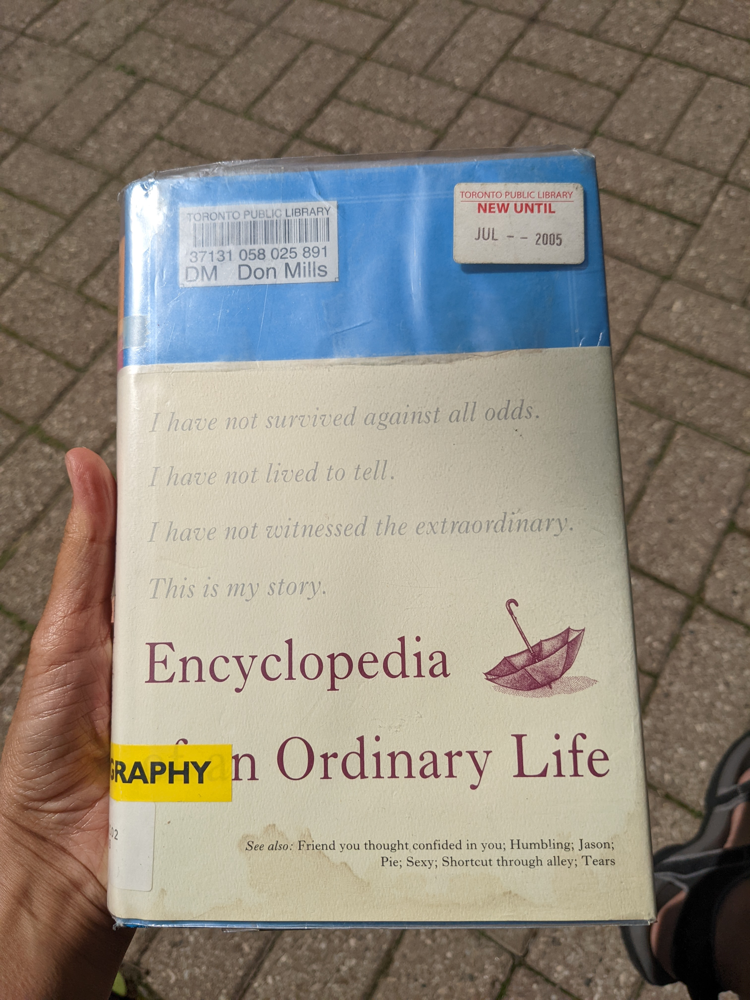
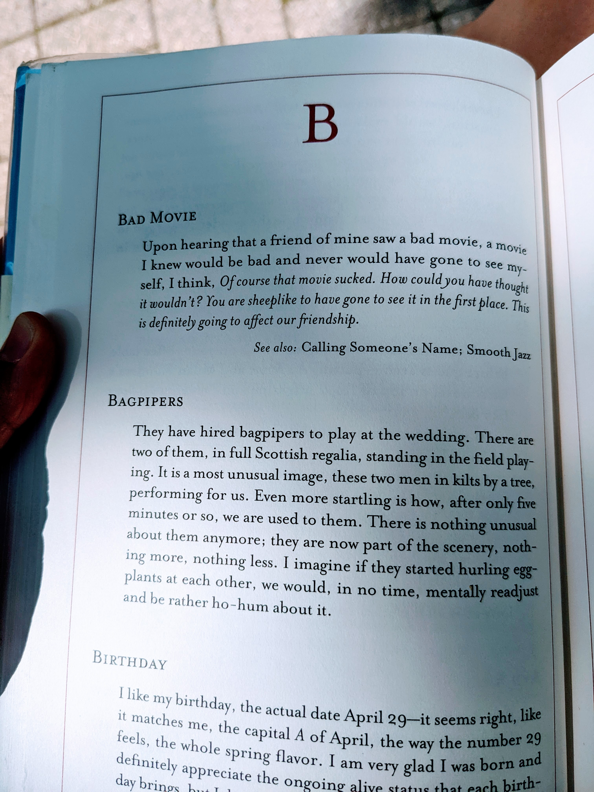

I was introduced to Amy Rosenthal and this book in John Green's [The Anthropocene Reviewed](https://deborah-digges.github.io/2022/05/27/the-anthropocene-reviewed) in which Green speaks highly of Amy and about their friendship.

The particular excerpt that drew me to her work was this one. When she reached 40, Rosenthal began calculating how many days she had left until she turned 80.

"How many more times, then, do I get to look at a tree?" she asked. "Let's just say it's 12,395. Absolutely, that's a lot, but it's not infinite, and I'm thinking anything less than infinite is too small a number and not satisfactory. At the very least, I want to look at trees a million more times. Is that too much to ask?"

This book is specifically described by Amy as being 'not a biography', so it's funny to see the big yellow BIOGRAPHY label slapped on the cover of my library copy of the book.

It is an ENCYLOPEDIA of all the little tidbits of Rosenthal's life and her musings about the finiteness of human existence arranged in alphabetical order and illustrated in the style of an encyclopedia.

It is an interesting format; the alphabetic grouping makes the reader jump from one arcane topic to another in a short period of time, which can be disorienting. It reads more like an assorted collection of Amy's musings and back-of-the-napkin notes to herself than it does a book. There are some topics that are poignant and make you stop to reflect on the beauty of life and such, but they are interspersed sparingly between the more trite portions of her day to day existence, giving the reader little chance to appreciate the better portions of the book.

This book drew me to look further into Rosenthal's life which led me to her heart wrenching column in the New York Times: [You May Want to Marry My Husband](https://www.nytimes.com/2017/03/03/style/modern-love-you-may-want-to-marry-my-husband.html). It is an unconventional dating profile she wrote for her husband Jason Rosenthal 10 days before she tragically passed away from ovarian cancer. She was a woman who was loved dearly by her family and left an ocean of grief when she passed.

I am a huge fan of Amy Rosenthal as a writer and the way in which she could turn a phrase, even while staring in the face of death. However, I wasn't a huge fan of the book because its scattered structure & content took away from some of its more intimate themes. I give the encyclopedia 3/5 stars.
