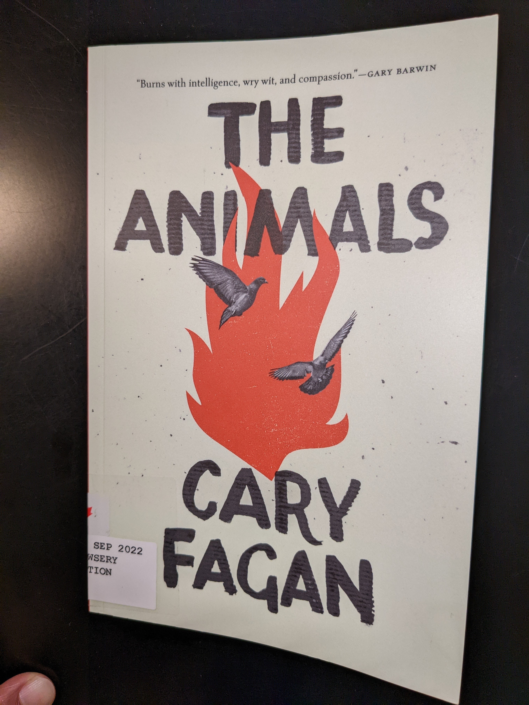

This was a book I judged by its cover and picked up off the [browsery](https://torontopubliclibrary.typepad.com/north-york-central-blog/2012/05/what-is-a-browsery.html#:~:text=You%20may%20wonder%2C%20what%20is,CDs%20and%20DVDs%20and%20magazines.) on a recent trip to the library. The two birds on the cover&mdash;one flying into the burning flame and the other flying upwards from it&mdash;caught my eye, as did the testimonial from Gary Barwin: 

> "Burns with intelligence, dry wit, and Compassion!"
 

It is set in an idyllic village where government funding has transformed every building, with the exception of a few, into a mystic and nostalgic tourist attraction. It is told through the lens of the village model maker, Dorn, who constructs miniature models of the village's quaint buildings; the models adorn the windows of these buildings to add to their quaintness. 

Dorn's life unfolds through crisp, musical prose, and with the occasional hint of realism. There is, of course, the story of unrequited love as he struggles to muster the courage to profess his love for Ravenna, his teacher friend from the local elementary school. Then there is the family: his father, the unloving patriarch whom he pays the obligatory visit to; his pompous and more successful younger brother who treats him like a doormat; his loving mother who filled his childhood with joy, but who was buried when he was just six. 

It's not a bad life: he is well reputed for his craft, he makes time for leisure reading, and he rides his trike around the village, making deliveries of his models and stalking his teacher friend at the school. Still, I could hear his feet dragging through the pages. 

> Thumping up in his boots, he felt equal amounts of stimulation and dread, as if he were about to prove there was no purpose to this existence beyond the excitement of humiliation. 

He ruminates through the pages about how he has taken no risks in life and how he has spent most of his life in this little village. 

One day, the village announces a new program, "Bring the Wild Home": 

> Obtain your animal license today from the Village Hall - be part of this exciting pilot project.

Dorn's neighbor, Leev, gets a wolf; soon after, Dorn finds him dead by the river with distinct wolf-like marks over his face and body. The village council, to avoid dampening the growing enthusiasm for the program, puts it down to suicide: "Villager did not seek help". Leev is buried soon after. 

Over time, families in the village get all sorts of animals: racoons, otters, and rats. Dorn's next-door neighbor even gets a bear that can often be seen bounding down the street chasing the children on their bikes. Eventually, the rats chew up the electrical wiring in the village buildings; a fire starts that burns the village to a crisp along with 15 years' worth of Dorn's handiwork - every one of his miniature models is destroyed. Not a single villager dies, but they all move to the city to start new lives. The book ends with Dorn searching out Ravenna, and drops off at a cliffhanger. 

What was the point of the animals? Was it malice? Or just a misguided idea that people found romantic? What does it matter; what is the point of anything, really? 

> I have learned that sometimes there is evil and sometimes there is stupidity, and not infrequently, the two are so close as to be impossible to tell apart.

Cary Fagan pays careful attention to the sensory detail of each scene and convinced me that I was right there with Dorn as each scene of his dreary life unfolded and as he plodded along, fervently yet remorsefully. Fagan develops a relatable and wholesome character in Dorn; I found myself rooting for him throughout the book and felt a connection with his life and his world that was only possible because of Fagan's craftsmanship. It's a whimsical, fairytale-like, slice-of-life story with several threads expertly pulled together to create a clear image of a beautifully wrought world. I give it 5/5 stars!

